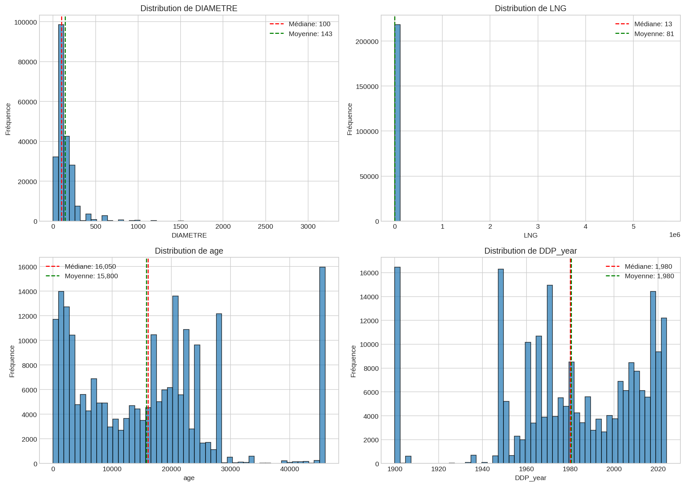
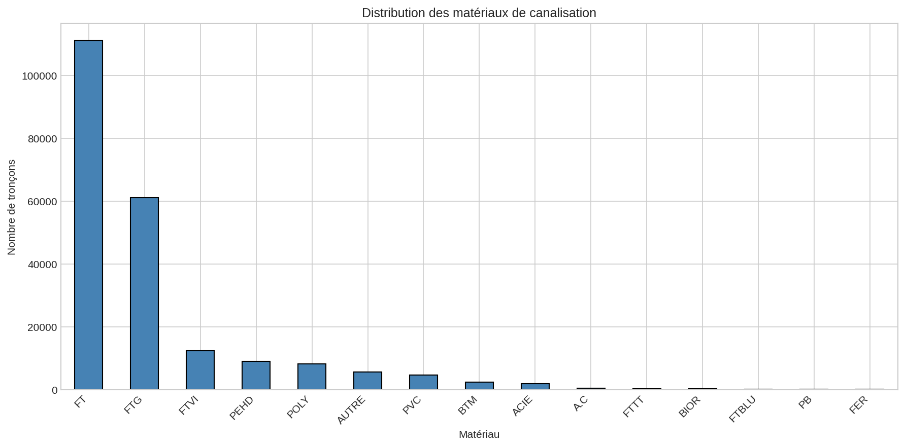
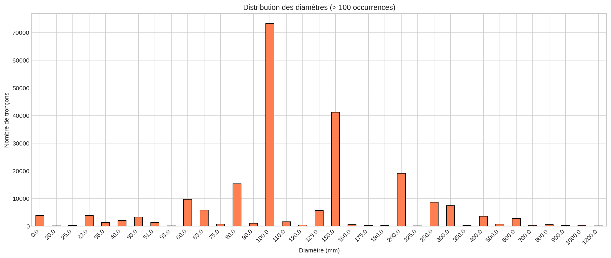
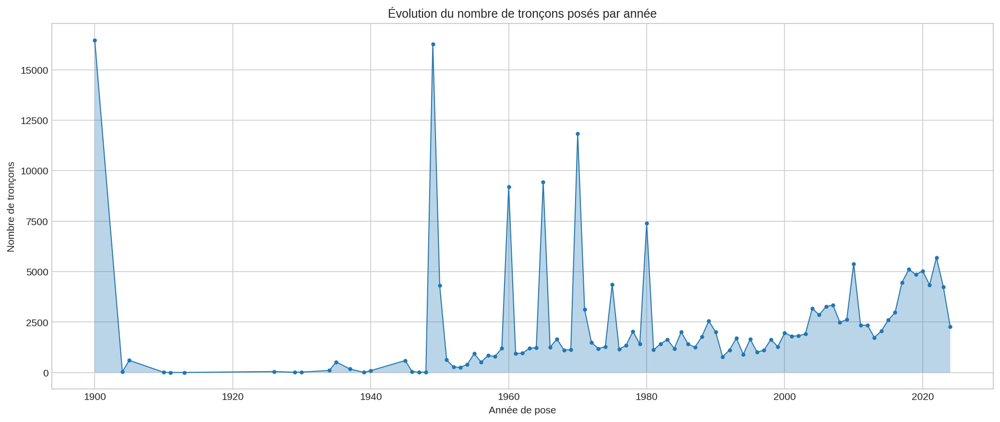
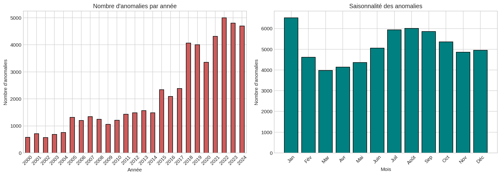
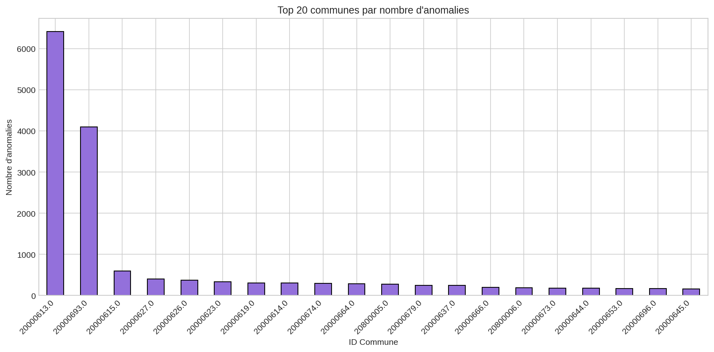

# Analyse Exploratoire des Données (EDA)
*Date de génération : 2026-02-03 11:46:56*

## 1. Statistiques descriptives des variables numériques

### Table troncons
| Statistique | DIAMETRE | LNG | age | DDP_year |
|-------------|---|---|---|---|
| count | 218,076.00 | 218,141.00 | 215,798.00 | 218,141.00 |
| mean | 142.98 | 81.07 | 15,799.87 | 1,980.44 |
| std | 119.61 | 14,157.16 | 12,330.37 | 33.38 |
| min | 0.00 | 0.00 | 0.00 | 1,900.00 |
| 25% | 100.00 | 5.19 | 4,717.00 | 1,961.00 |
| 50% | 100.00 | 13.35 | 16,050.00 | 1,980.00 |
| 75% | 150.00 | 43.58 | 22,259.00 | 2,010.00 |
| max | 3,200.00 | 5,701,102.00 | 46,000.00 | 2,024.00 |

## 2. Distribution des variables catégorielles

### Distribution des matériaux (MAT)
| Matériau | Nombre | % |
|----------|--------|---|
| FT | 111,025 | 50.9% |
| FTG | 61,082 | 28.0% |
| FTVI | 12,307 | 5.6% |
| PEHD | 8,934 | 4.1% |
| POLY | 8,152 | 3.7% |
| AUTRE | 5,681 | 2.6% |
| PVC | 4,632 | 2.1% |
| BTM | 2,393 | 1.1% |
| ACIE | 1,859 | 0.9% |
| A.C | 486 | 0.2% |
| FTTT | 318 | 0.1% |
| BIOR | 276 | 0.1% |
| FTBLU | 180 | 0.1% |
| PB | 160 | 0.1% |
| FER | 141 | 0.1% |

### Distribution des diamètres
| Diamètre (mm) | Nombre | % |
|---------------|--------|---|
| 0.0 | 3,857 | 1.8% |
| 20.0 | 140 | 0.1% |
| 21.0 | 21 | 0.0% |
| 25.0 | 297 | 0.1% |
| 30.0 | 77 | 0.0% |
| 32.0 | 3,993 | 1.8% |
| 33.0 | 23 | 0.0% |
| 35.0 | 1 | 0.0% |
| 36.0 | 1,393 | 0.6% |
| 40.0 | 2,009 | 0.9% |
| 42.0 | 7 | 0.0% |
| 46.0 | 2 | 0.0% |
| 49.0 | 2 | 0.0% |
| 50.0 | 3,269 | 1.5% |
| 51.0 | 1,412 | 0.6% |

### Distribution par décennie de pose
| Décennie | Nombre | % |
|----------|--------|---|
| 1900s | 17,100 | 7.8% |
| 1910s | 16 | 0.0% |
| 1920s | 61 | 0.0% |
| 1930s | 826 | 0.4% |
| 1940s | 17,048 | 7.8% |
| 1950s | 10,161 | 4.7% |
| 1960s | 28,130 | 12.9% |
| 1970s | 29,203 | 13.4% |
| 1980s | 21,745 | 10.0% |
| 1990s | 13,185 | 6.0% |
| 2000s | 25,247 | 11.6% |
| 2010s | 33,855 | 15.5% |
| 2020s | 21,564 | 9.9% |

## 3. Analyse temporelle des anomalies

### Évolution annuelle des anomalies
| Année | Nombre d'anomalies |
|-------|--------------------|
| 2000 | 574 |
| 2001 | 709 |
| 2002 | 573 |
| 2003 | 686 |
| 2004 | 755 |
| 2005 | 1,317 |
| 2006 | 1,199 |
| 2007 | 1,342 |
| 2008 | 1,242 |
| 2009 | 1,061 |
| 2010 | 1,207 |
| 2011 | 1,434 |
| 2012 | 1,483 |
| 2013 | 1,569 |
| 2014 | 1,484 |
| 2015 | 2,342 |
| 2016 | 2,088 |
| 2017 | 2,382 |
| 2018 | 4,065 |
| 2019 | 4,004 |
| 2020 | 3,357 |
| 2021 | 4,320 |
| 2022 | 4,999 |
| 2023 | 4,801 |
| 2024 | 4,702 |

### Distribution par type d'anomalie
| Type | Nombre | % |
|------|--------|---|
| FUITE_SIGNAL_TR | 25,768 | 41.8% |
| FUITE_SIGNAL_BR | 9,598 | 15.6% |
| FUITE_DETECT_BR | 5,211 | 8.5% |
| FUITE_DETECT_TR | 3,951 | 6.4% |
| DEGAT_TR | 1,594 | 2.6% |
| INTROU_VANNE | 1,084 | 1.8% |
| INA_VANNE | 931 | 1.5% |
| VETUSTE_BR | 906 | 1.5% |
| ENQUETE_EQUIP | 896 | 1.5% |
| INTROU_VIDANGE | 756 | 1.2% |
| INTROU_VENTOUSE | 740 | 1.2% |
| DEGAT_BR | 719 | 1.2% |
| INA_BR | 701 | 1.1% |
| EAU_ROUGE | 637 | 1.0% |
| FUITE_DETECT_VANNE | 544 | 0.9% |
| ENQUETE_VANNE | 535 | 0.9% |
| HS_VANNE | 516 | 0.8% |
| HS_BR | 509 | 0.8% |
| FUITE_SIGNAL_VANNE | 418 | 0.7% |
| NONMAN_VANNE | 377 | 0.6% |
| FUITE | 364 | 0.6% |
| ENGORGE_VANNE | 358 | 0.6% |
| NONMAN_BR | 338 | 0.5% |
| REVETSOL_BR | 313 | 0.5% |
| ENGORGE_BR | 299 | 0.5% |
| PRBTAMPON_VANNE | 271 | 0.4% |
| INTROU_VAIR200 | 270 | 0.4% |
| INA_VENTOUSE | 240 | 0.4% |
| HS_VENTOUSE | 215 | 0.3% |
| HS_HYDRANT | 186 | 0.3% |
| INTROU_VENTMANU | 159 | 0.3% |
| INA_VIDANGE | 150 | 0.2% |
| INA_VAIR200 | 147 | 0.2% |
| INTROU_BR | 122 | 0.2% |
| HS_VAIR200 | 116 | 0.2% |
| FUITE_VENTOUSE | 101 | 0.2% |
| INTROU_VIDBORGNE | 76 | 0.1% |
| PRBREGARD_VENTOUSE | 68 | 0.1% |
| VETUSTE_VANNE | 66 | 0.1% |
| FUITE_VAIR200 | 61 | 0.1% |
| DEFAUT_PRESSION | 61 | 0.1% |
| PRBREGARD_VAIR200 | 59 | 0.1% |
| INTROU_VIDRACC | 47 | 0.1% |
| REVETSOL_VANNE | 47 | 0.1% |
| ENQUETE_HYDRANT | 45 | 0.1% |
| PRBTAMPON_VENTOUSE | 43 | 0.1% |
| INA_VENTMANU | 43 | 0.1% |
| PRBREGARD_VIDBORGNE | 39 | 0.1% |
| PRBREGARD_VIDANGE | 38 | 0.1% |
| PRBTAMPON_VIDANGE | 38 | 0.1% |
| VETUSTE_VENTOUSE | 36 | 0.1% |
| ENGORGE_VIDANGE | 36 | 0.1% |
| NONMAN_VIDANGE | 35 | 0.1% |
| NONMAN_VENTOUSE | 35 | 0.1% |
| SABLE | 34 | 0.1% |
| VETUSTE_HYDRANT | 33 | 0.1% |
| HS_EQUIPPUB | 29 | 0.0% |
| HS_VIDANGE | 25 | 0.0% |
| ENGORGE_VAIR200 | 23 | 0.0% |
| INA_VIDBORGNE | 22 | 0.0% |
| ENGORGE_VENTOUSE | 22 | 0.0% |
| TARTRE | 21 | 0.0% |
| ODEUR | 21 | 0.0% |
| FUITE_VIDANGE | 21 | 0.0% |
| INTROU_VAIR500 | 20 | 0.0% |
| NONMAN_HYDRANT | 20 | 0.0% |
| VETUSTE_VAIR200 | 18 | 0.0% |
| PRBTAMPON_VAIR200 | 17 | 0.0% |
| HS_VENTMANU | 15 | 0.0% |
| SAVEUR | 14 | 0.0% |
| INA_VAIR1000 | 13 | 0.0% |
| VETUSTE_EQUIPPUB | 13 | 0.0% |
| HS_VAIR500 | 12 | 0.0% |
| ENGORGE_VIDBORGNE | 12 | 0.0% |
| PRESENCE_AIR | 12 | 0.0% |
| PRBREGARD_VENTMANU | 11 | 0.0% |
| INA_HYDRANT | 11 | 0.0% |
| HS_VAIR1000 | 11 | 0.0% |
| OBSTRUCTION | 11 | 0.0% |
| NONMAN_VAIR200 | 10 | 0.0% |
| INTROU_EQUIPPUB | 10 | 0.0% |
| INTROU_VAIR1000 | 10 | 0.0% |
| INA_VIDRACC | 8 | 0.0% |
| NONMAN_EQUIPPUB | 8 | 0.0% |
| ENTRETIEN_CRT_REGARD | 8 | 0.0% |
| PRBREGARD_VIDRACC | 7 | 0.0% |
| PRBTAMPON_VENTMANU | 7 | 0.0% |
| INTROU_HYDRANT | 7 | 0.0% |
| NONMAN_VIDBORGNE | 7 | 0.0% |
| REVETSOL_VENTOUSE | 7 | 0.0% |
| VOL_EAU | 7 | 0.0% |
| INA_HYDROSTAB | 6 | 0.0% |
| PRBTAMPON_VIDBORGNE | 6 | 0.0% |
| FUITE_MONOVAR | 6 | 0.0% |
| FUITE_VAIR500 | 6 | 0.0% |
| INA_SECMESDEB | 5 | 0.0% |
| ENGORGE_VENTMANU | 5 | 0.0% |
| VETUSTE_VIDANGE | 5 | 0.0% |
| INA_VAIR500 | 5 | 0.0% |
| PRBREGARD_VAIR1000 | 5 | 0.0% |
| PRBREGARD_HYDROSTAB | 5 | 0.0% |
| FUITE_VIDBORGNE | 5 | 0.0% |
| INA_EQUIPPUB | 5 | 0.0% |
| NONMAN_VENTMANU | 4 | 0.0% |
| FUITE_SECMESDEB | 4 | 0.0% |
| FUITE_DETENDEUR | 4 | 0.0% |
| PRBTAMPON_HYDROSTAB | 4 | 0.0% |
| VETUSTE_VENTMANU | 4 | 0.0% |
| VETUSTE_MONOVAR | 4 | 0.0% |
| REVETSOL_VIDANGE | 4 | 0.0% |
| VETUSTE_SECMESDEB | 4 | 0.0% |
| PRBREGARD_SECMESDEB | 3 | 0.0% |
| INTROU_PURGE | 3 | 0.0% |
| HS_VIDRACC | 3 | 0.0% |
| HS_PURGE | 3 | 0.0% |
| NONMAN_VIDRACC | 3 | 0.0% |
| ENGORGE_VIDRACC | 3 | 0.0% |
| FUITE_VENTMANU | 3 | 0.0% |
| HS_VIDBORGNE | 3 | 0.0% |
| REVETSOL_HYDRANT | 3 | 0.0% |
| FUITE_VAIR1000 | 3 | 0.0% |
| UFERMETURE_REGARD | 3 | 0.0% |
| PRBREGARD_VAIR500 | 2 | 0.0% |
| INA_DETENDEUR | 2 | 0.0% |
| NONMAN_MVENT | 2 | 0.0% |
| PRBTAMPON_VIDRACC | 2 | 0.0% |
| VETUSTE_HYDROSTAB | 2 | 0.0% |
| FUITE_VIDRACC | 2 | 0.0% |
| INTROU_MVENT | 2 | 0.0% |
| FUITE_MVENT | 1 | 0.0% |
| ENGORGE_VAIR1000 | 1 | 0.0% |
| INTROU_SECMESDEB | 1 | 0.0% |
| INA_PURGE | 1 | 0.0% |
| FUITE_HYDROSTAB | 1 | 0.0% |
| HS_SECMESDEB | 1 | 0.0% |
| REVETSOL_VIDBORGNE | 1 | 0.0% |
| INA_MVENT | 1 | 0.0% |
| NONMAN_VAIR500 | 1 | 0.0% |
| VETUSTE_VAIR500 | 1 | 0.0% |
| VETUSTE_VIDRACC | 1 | 0.0% |
| VETUSTE_DETENDEUR | 1 | 0.0% |
| REVETSOL_HYDROSTAB | 1 | 0.0% |
| PRBTAMPON_VAIR1000 | 1 | 0.0% |
| VETUSTE_VIDBORGNE | 1 | 0.0% |
| PRBREGARD_PURGE | 1 | 0.0% |
| REVETSOL_EQUIPPUB | 1 | 0.0% |
| UARB_MEN_ESPACE_VERT | 1 | 0.0% |
| PRBREGARD_DETENDEUR | 1 | 0.0% |
| ENTC_ESPACE_VERT | 1 | 0.0% |
| DESOR_GC_SOUTERRAIN | 1 | 0.0% |
| NONMAN_VAIR1000 | 1 | 0.0% |
| DESOR_GC_CIEL_OUVERT | 1 | 0.0% |
| DESOR_GC_REGARD | 1 | 0.0% |

## 4. Analyse géographique

### Top 20 communes par nombre d'anomalies
| GID_COMMUNE | Nombre d'anomalies |
|-------------|--------------------|
| 20000613.0 | 6,419 |
| 20000693.0 | 4,102 |
| 20000615.0 | 594 |
| 20000627.0 | 399 |
| 20000626.0 | 372 |
| 20000623.0 | 334 |
| 20000619.0 | 305 |
| 20000614.0 | 303 |
| 20000674.0 | 296 |
| 20000664.0 | 288 |
| 20800005.0 | 276 |
| 20000679.0 | 248 |
| 20000637.0 | 245 |
| 20000666.0 | 194 |
| 20800006.0 | 185 |
| 20000673.0 | 183 |
| 20000644.0 | 177 |
| 20000653.0 | 169 |
| 20000696.0 | 168 |
| 20000645.0 | 159 |

