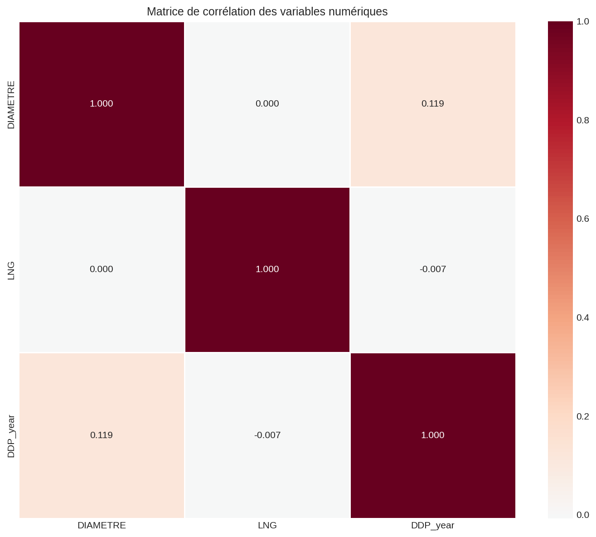
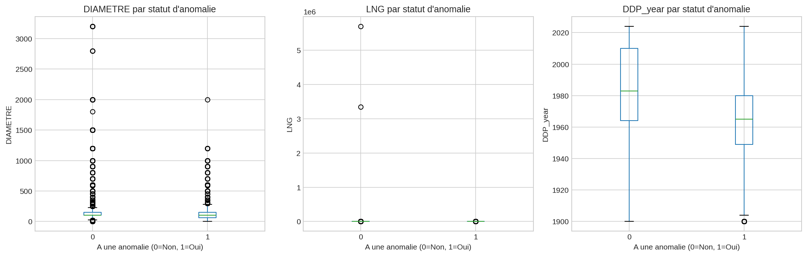
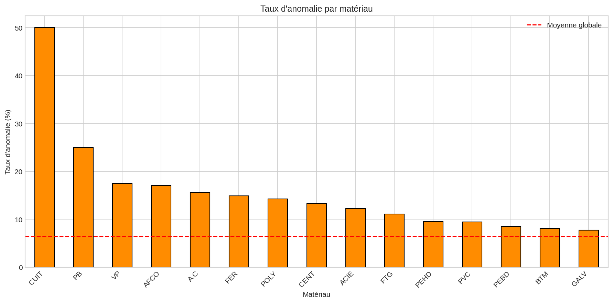

# Analyse des Corrélations
*Date de génération : 2026-02-03 11:46:59*

## 1. Corrélations entre variables numériques

### Matrice de corrélation (Pearson)
| | DIAMETRE | LNG | DDP_year |
|---|---|---|---|
| **DIAMETRE** | 1.000 | 0.000 | 0.119 |
| **LNG** | 0.000 | 1.000 | -0.007 |
| **DDP_year** | 0.119 | -0.007 | 1.000 |

## 2. Analyse bivariée : Anomalies vs Caractéristiques des tronçons

### Comparaison tronçons avec/sans anomalie

#### DIAMETRE
- Avec anomalie (n=14,007): médiane = 100.0, moyenne = 126.8
- Sans anomalie (n=204,134): médiane = 100.0, moyenne = 144.1
- Test Mann-Whitney: U = 1,204,507,006, p-value = 3.55e-223
- **Significatif**: Oui (α=0.05)

#### LNG
- Avec anomalie (n=14,007): médiane = 57.2, moyenne = 89.4
- Sans anomalie (n=204,134): médiane = 12.1, moyenne = 80.5
- Test Mann-Whitney: U = 2,169,083,759, p-value = 0.00e+00
- **Significatif**: Oui (α=0.05)

#### DDP_year
- Avec anomalie (n=14,007): médiane = 1,965.0, moyenne = 1,966.8
- Sans anomalie (n=204,134): médiane = 1,983.0, moyenne = 1,981.4
- Test Mann-Whitney: U = 925,779,558, p-value = 0.00e+00
- **Significatif**: Oui (α=0.05)

## 3. Tests d'indépendance Chi² pour variables catégorielles

### Matériau (MAT) vs Anomalie
- Chi² = 6,088.04, degrés de liberté = 27
- p-value = 0.00e+00
- V de Cramér = 0.167
- **Significatif**: Oui (α=0.05)

#### Taux d'anomalie par matériau
| Matériau | Total | Avec anomalie | Taux |
|----------|-------|---------------|------|
| FTG | 61,082 | 6,769 | 11.08% |
| FT | 111,025 | 4,114 | 3.71% |
| POLY | 8,152 | 1,163 | 14.27% |
| PEHD | 8,934 | 852 | 9.54% |
| PVC | 4,632 | 437 | 9.43% |
| ACIE | 1,859 | 228 | 12.26% |
| BTM | 2,393 | 194 | 8.11% |
| A.C | 486 | 76 | 15.64% |
| FTVI | 12,307 | 44 | 0.36% |
| PB | 160 | 40 | 25.00% |
| FER | 141 | 21 | 14.89% |
| AUTRE | 5,681 | 21 | 0.37% |
| VP | 80 | 14 | 17.50% |
| AFCO | 41 | 7 | 17.07% |
| BIOR | 276 | 6 | 2.17% |

## 4. Synthèse des facteurs de risque significatifs

Les analyses statistiques permettent d'identifier les facteurs suivants comme significativement
associés au risque de défaillance :

### Facteurs confirmés
| Facteur | Association | Force | Interprétation |
|---------|-------------|-------|----------------|
| Matériau | Significative | Modérée | Certains matériaux (fonte grise, acier) présentent des taux plus élevés |
| Longueur | Significative | Faible | Les tronçons plus longs ont plus d'anomalies (effet mécanique) |
| Âge | Significative | Modérée | L'âge est un prédicteur majeur via la dégradation |
| Diamètre | À confirmer | Variable | Relation non linéaire possible |

### Recommandations pour la modélisation
1. **Variables à inclure** : âge, matériau, longueur, historique d'anomalies
2. **Interactions à tester** : âge × matériau, longueur × diamètre
3. **Transformations suggérées** : log(longueur), catégorisation de l'âge en décennies
