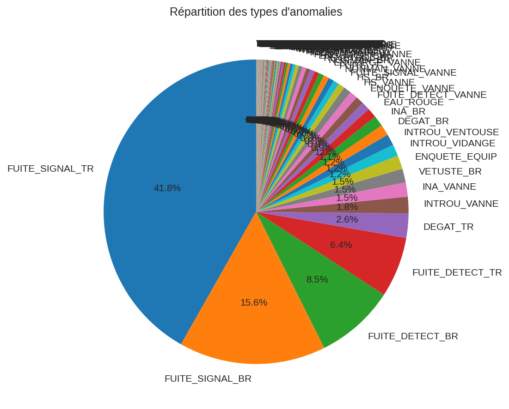
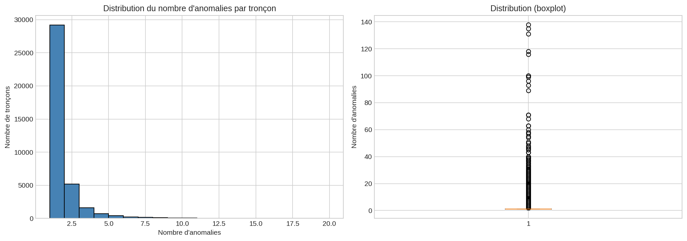
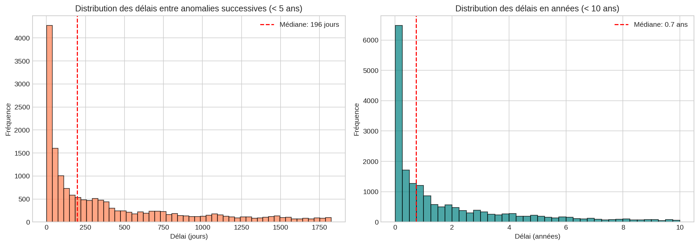

# Analyse des Anomalies
*Date de génération : 2026-02-03 11:47:00*

## 1. Typologie des anomalies

### Distribution par type
| Type | Nombre | % |
|------|--------|---|
| FUITE_SIGNAL_TR | 25,768 | 41.8% |
| FUITE_SIGNAL_BR | 9,598 | 15.6% |
| FUITE_DETECT_BR | 5,211 | 8.5% |
| FUITE_DETECT_TR | 3,951 | 6.4% |
| DEGAT_TR | 1,594 | 2.6% |
| INTROU_VANNE | 1,084 | 1.8% |
| INA_VANNE | 931 | 1.5% |
| VETUSTE_BR | 906 | 1.5% |
| ENQUETE_EQUIP | 896 | 1.5% |
| INTROU_VIDANGE | 756 | 1.2% |
| INTROU_VENTOUSE | 740 | 1.2% |
| DEGAT_BR | 719 | 1.2% |
| INA_BR | 701 | 1.1% |
| EAU_ROUGE | 637 | 1.0% |
| FUITE_DETECT_VANNE | 544 | 0.9% |
| ENQUETE_VANNE | 535 | 0.9% |
| HS_VANNE | 516 | 0.8% |
| HS_BR | 509 | 0.8% |
| FUITE_SIGNAL_VANNE | 418 | 0.7% |
| NONMAN_VANNE | 377 | 0.6% |
| FUITE | 364 | 0.6% |
| ENGORGE_VANNE | 358 | 0.6% |
| NONMAN_BR | 338 | 0.5% |
| REVETSOL_BR | 313 | 0.5% |
| ENGORGE_BR | 299 | 0.5% |
| PRBTAMPON_VANNE | 271 | 0.4% |
| INTROU_VAIR200 | 270 | 0.4% |
| INA_VENTOUSE | 240 | 0.4% |
| HS_VENTOUSE | 215 | 0.3% |
| HS_HYDRANT | 186 | 0.3% |
| INTROU_VENTMANU | 159 | 0.3% |
| INA_VIDANGE | 150 | 0.2% |
| INA_VAIR200 | 147 | 0.2% |
| INTROU_BR | 122 | 0.2% |
| HS_VAIR200 | 116 | 0.2% |
| FUITE_VENTOUSE | 101 | 0.2% |
| INTROU_VIDBORGNE | 76 | 0.1% |
| PRBREGARD_VENTOUSE | 68 | 0.1% |
| VETUSTE_VANNE | 66 | 0.1% |
| FUITE_VAIR200 | 61 | 0.1% |
| DEFAUT_PRESSION | 61 | 0.1% |
| PRBREGARD_VAIR200 | 59 | 0.1% |
| INTROU_VIDRACC | 47 | 0.1% |
| REVETSOL_VANNE | 47 | 0.1% |
| ENQUETE_HYDRANT | 45 | 0.1% |
| PRBTAMPON_VENTOUSE | 43 | 0.1% |
| INA_VENTMANU | 43 | 0.1% |
| PRBREGARD_VIDBORGNE | 39 | 0.1% |
| PRBREGARD_VIDANGE | 38 | 0.1% |
| PRBTAMPON_VIDANGE | 38 | 0.1% |
| VETUSTE_VENTOUSE | 36 | 0.1% |
| ENGORGE_VIDANGE | 36 | 0.1% |
| NONMAN_VIDANGE | 35 | 0.1% |
| NONMAN_VENTOUSE | 35 | 0.1% |
| SABLE | 34 | 0.1% |
| VETUSTE_HYDRANT | 33 | 0.1% |
| HS_EQUIPPUB | 29 | 0.0% |
| HS_VIDANGE | 25 | 0.0% |
| ENGORGE_VAIR200 | 23 | 0.0% |
| INA_VIDBORGNE | 22 | 0.0% |
| ENGORGE_VENTOUSE | 22 | 0.0% |
| TARTRE | 21 | 0.0% |
| ODEUR | 21 | 0.0% |
| FUITE_VIDANGE | 21 | 0.0% |
| INTROU_VAIR500 | 20 | 0.0% |
| NONMAN_HYDRANT | 20 | 0.0% |
| VETUSTE_VAIR200 | 18 | 0.0% |
| PRBTAMPON_VAIR200 | 17 | 0.0% |
| HS_VENTMANU | 15 | 0.0% |
| SAVEUR | 14 | 0.0% |
| INA_VAIR1000 | 13 | 0.0% |
| VETUSTE_EQUIPPUB | 13 | 0.0% |
| HS_VAIR500 | 12 | 0.0% |
| ENGORGE_VIDBORGNE | 12 | 0.0% |
| PRESENCE_AIR | 12 | 0.0% |
| PRBREGARD_VENTMANU | 11 | 0.0% |
| INA_HYDRANT | 11 | 0.0% |
| HS_VAIR1000 | 11 | 0.0% |
| OBSTRUCTION | 11 | 0.0% |
| NONMAN_VAIR200 | 10 | 0.0% |
| INTROU_EQUIPPUB | 10 | 0.0% |
| INTROU_VAIR1000 | 10 | 0.0% |
| INA_VIDRACC | 8 | 0.0% |
| NONMAN_EQUIPPUB | 8 | 0.0% |
| ENTRETIEN_CRT_REGARD | 8 | 0.0% |
| PRBREGARD_VIDRACC | 7 | 0.0% |
| PRBTAMPON_VENTMANU | 7 | 0.0% |
| INTROU_HYDRANT | 7 | 0.0% |
| NONMAN_VIDBORGNE | 7 | 0.0% |
| REVETSOL_VENTOUSE | 7 | 0.0% |
| VOL_EAU | 7 | 0.0% |
| INA_HYDROSTAB | 6 | 0.0% |
| PRBTAMPON_VIDBORGNE | 6 | 0.0% |
| FUITE_MONOVAR | 6 | 0.0% |
| FUITE_VAIR500 | 6 | 0.0% |
| INA_SECMESDEB | 5 | 0.0% |
| ENGORGE_VENTMANU | 5 | 0.0% |
| VETUSTE_VIDANGE | 5 | 0.0% |
| INA_VAIR500 | 5 | 0.0% |
| PRBREGARD_VAIR1000 | 5 | 0.0% |
| PRBREGARD_HYDROSTAB | 5 | 0.0% |
| FUITE_VIDBORGNE | 5 | 0.0% |
| INA_EQUIPPUB | 5 | 0.0% |
| NONMAN_VENTMANU | 4 | 0.0% |
| FUITE_SECMESDEB | 4 | 0.0% |
| FUITE_DETENDEUR | 4 | 0.0% |
| PRBTAMPON_HYDROSTAB | 4 | 0.0% |
| VETUSTE_VENTMANU | 4 | 0.0% |
| VETUSTE_MONOVAR | 4 | 0.0% |
| REVETSOL_VIDANGE | 4 | 0.0% |
| VETUSTE_SECMESDEB | 4 | 0.0% |
| PRBREGARD_SECMESDEB | 3 | 0.0% |
| INTROU_PURGE | 3 | 0.0% |
| HS_VIDRACC | 3 | 0.0% |
| HS_PURGE | 3 | 0.0% |
| NONMAN_VIDRACC | 3 | 0.0% |
| ENGORGE_VIDRACC | 3 | 0.0% |
| FUITE_VENTMANU | 3 | 0.0% |
| HS_VIDBORGNE | 3 | 0.0% |
| REVETSOL_HYDRANT | 3 | 0.0% |
| FUITE_VAIR1000 | 3 | 0.0% |
| UFERMETURE_REGARD | 3 | 0.0% |
| PRBREGARD_VAIR500 | 2 | 0.0% |
| INA_DETENDEUR | 2 | 0.0% |
| NONMAN_MVENT | 2 | 0.0% |
| PRBTAMPON_VIDRACC | 2 | 0.0% |
| VETUSTE_HYDROSTAB | 2 | 0.0% |
| FUITE_VIDRACC | 2 | 0.0% |
| INTROU_MVENT | 2 | 0.0% |
| FUITE_MVENT | 1 | 0.0% |
| ENGORGE_VAIR1000 | 1 | 0.0% |
| INTROU_SECMESDEB | 1 | 0.0% |
| INA_PURGE | 1 | 0.0% |
| FUITE_HYDROSTAB | 1 | 0.0% |
| HS_SECMESDEB | 1 | 0.0% |
| REVETSOL_VIDBORGNE | 1 | 0.0% |
| INA_MVENT | 1 | 0.0% |
| NONMAN_VAIR500 | 1 | 0.0% |
| VETUSTE_VAIR500 | 1 | 0.0% |
| VETUSTE_VIDRACC | 1 | 0.0% |
| VETUSTE_DETENDEUR | 1 | 0.0% |
| REVETSOL_HYDROSTAB | 1 | 0.0% |
| PRBTAMPON_VAIR1000 | 1 | 0.0% |
| VETUSTE_VIDBORGNE | 1 | 0.0% |
| PRBREGARD_PURGE | 1 | 0.0% |
| REVETSOL_EQUIPPUB | 1 | 0.0% |
| UARB_MEN_ESPACE_VERT | 1 | 0.0% |
| PRBREGARD_DETENDEUR | 1 | 0.0% |
| ENTC_ESPACE_VERT | 1 | 0.0% |
| DESOR_GC_SOUTERRAIN | 1 | 0.0% |
| NONMAN_VAIR1000 | 1 | 0.0% |
| DESOR_GC_CIEL_OUVERT | 1 | 0.0% |
| DESOR_GC_REGARD | 1 | 0.0% |

### Caractérisation des anomalies (Top 15)
| Caractérisation | Nombre |
|-----------------|--------|
| AUTRE | 7,381 |
| URGENCE_ECOULEMENT_SURF | 6,336 |
| VETUSTE | 3,303 |
| PERFORATION | 2,072 |
| URGENCE_EVOLUTIVE | 1,627 |
| CHANGEMENT_TEMPERATURE | 1,580 |
| URGENCE_FORT_DEBIT | 1,212 |
| AGRESSION_CHIMIQUE | 1,168 |
| PROGRAMME | 922 |
| ENTERRE | 896 |
| URGENCE_INFILTRATION | 885 |
| FORTE_CORROSION | 550 |
| MAUVAIS_ETAT | 386 |
| TERRE | 370 |
| MOUVEMENT_SOL | 324 |

## 2. Fréquence et récurrence par tronçon

### Distribution du nombre d'anomalies par tronçon
| Nb anomalies | Nb tronçons | % |
|--------------|-------------|---|
| 1 | 29,201 | 76.6% |
| 2 | 5,178 | 13.6% |
| 3 | 1,631 | 4.3% |
| 4 | 735 | 1.9% |
| 5 | 410 | 1.1% |
| 6 | 235 | 0.6% |
| 7 | 179 | 0.5% |
| 8 | 108 | 0.3% |
| 9 | 75 | 0.2% |
| 10 | 61 | 0.2% |

### Statistiques de récurrence
- **Tronçons avec au moins 1 anomalie**: 38,122
- **Tronçons multi-récidivistes (≥3)**: 3,743
- **Moyenne d'anomalies par tronçon touché**: 1.62
- **Maximum d'anomalies sur un tronçon**: 138

## 3. Délai entre anomalies successives

### Statistiques des délais (en jours)
- **Nombre de délais calculés**: 20,367
- **Médiane**: 329 jours (0.9 ans)
- **Moyenne**: 1037 jours (2.8 ans)
- **Écart-type**: 1660 jours
- **Q25**: 55 jours
- **Q75**: 1262 jours

## 4. Tronçons multi-récidivistes

### Top 20 des tronçons les plus touchés
| GID Tronçon | Nb anomalies |
|-------------|---------------|
| 410134280 | 138 |
| 410131481 | 135 |
| 410134303 | 131 |
| 410134058 | 118 |
| 410052738 | 116 |
| 410130354 | 100 |
| 410133258 | 100 |
| 413001672 | 99 |
| 410052739 | 96 |
| 410134716 | 93 |
| 410134722 | 89 |
| 410131273 | 71 |
| 410134467 | 71 |
| 410134294 | 68 |
| 410131111 | 63 |
| 413002754 | 63 |
| 410134292 | 60 |
| 410133280 | 58 |
| 413001838 | 57 |
| 410132022 | 55 |

### Catégorisation par niveau de récurrence
| Catégorie | Définition | Nb tronçons | % |
|-----------|------------|-------------|---|
| Unique | - | 29,201 | 76.6% |
| Faible (2) | - | 5,178 | 13.6% |
| Modérée (3-5) | - | 2,776 | 7.3% |
| Élevée (6-10) | - | 658 | 1.7% |
| Très élevée (>10) | - | 309 | 0.8% |

### Comparaison récidivistes vs non-récidivistes

**DIAMETRE**
- Récidivistes: médiane = 80.0
- Non-récidivistes: médiane = 100.0

**LNG**
- Récidivistes: médiane = 79.8
- Non-récidivistes: médiane = 13.1

**DDP_year**
- Récidivistes: médiane = 1,960.0
- Non-récidivistes: médiane = 1,980.0
