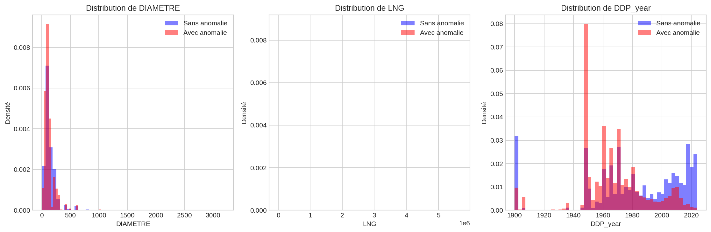

# Évaluation de la Prédictibilité
*Date de génération : 2026-02-03 11:47:02*

## 1. Définition de la variable cible

### Approche recommandée : Fenêtre temporelle (Freeze + Horizon)

Pour prédire les défaillances futures sans fuite de données, nous utilisons l'approche suivante :

1. **FREEZE_DATE** : Date de référence pour séparer passé et futur
2. **HORIZON** : Période de prédiction (ex: 12 mois)
3. **Variable cible** : Y = 1 si anomalie détectée entre FREEZE_DATE et FREEZE_DATE + HORIZON

Cette approche garantit que :
- Toutes les features sont calculées avec des données ANTÉRIEURES à FREEZE_DATE
- La cible est définie sur la période POSTÉRIEURE à FREEZE_DATE
- Aucune fuite de données n'est possible

### Formulation mathématique

```
Y_i = 1 si ∃ anomalie pour tronçon i dans [FREEZE_DATE, FREEZE_DATE + HORIZON]
Y_i = 0 sinon
```

## 2. Taux de base (Base Rate)

### Statistiques globales
- **Total tronçons**: 218,141
- **Tronçons avec au moins 1 anomalie (historique complet)**: 38,122
- **Taux de base global**: 17.48%

### Taux annuels (5 dernières années)
| Année | Tronçons touchés | Taux |
|-------|------------------|------|
| 2020 | - | 1.38% |
| 2021 | - | 1.77% |
| 2022 | - | 2.01% |
| 2023 | - | 1.93% |
| 2024 | - | 1.70% |

**Taux moyen annuel estimé**: 1.76%

## 3. Analyse de la séparabilité des classes

### Distributions par classe

**DIAMETRE**
- Test KS: D = 0.167, p-value = 2.11e-319
- Séparabilité: Modérée

**LNG**
- Test KS: D = 0.400, p-value = 0.00e+00
- Séparabilité: Bonne

**DDP_year**
- Test KS: D = 0.305, p-value = 0.00e+00
- Séparabilité: Bonne



## 4. Features prometteuses pour la modélisation

### Features de base (disponibles)
| Feature | Type | Disponibilité | Pouvoir prédictif attendu |
|---------|------|---------------|---------------------------|
| Âge du tronçon | Numérique | ✅ Disponible | Élevé |
| Matériau (MAT) | Catégoriel | ✅ Disponible | Élevé |
| Diamètre | Numérique | ✅ Disponible | Modéré |
| Longueur (LNG) | Numérique | ✅ Disponible | Modéré |
| Décennie de pose | Catégoriel | ✅ Dérivable | Élevé |

### Features d'historique (à construire)
| Feature | Description | Pouvoir prédictif attendu |
|---------|-------------|---------------------------|
| n_anomalies_past | Nombre d'anomalies passées | Très élevé |
| n_anomalies_1y | Anomalies dans les 12 derniers mois | Élevé |
| days_since_last | Jours depuis dernière anomalie | Élevé |
| leak_rate | Taux de fuite par an | Élevé |

### Features contextuelles (si disponibles)
| Feature | Source | Pouvoir prédictif attendu |
|---------|--------|---------------------------|
| Trafic routier | troncon_dt | Modéré |
| Nb logements | troncon_dt | Faible |
| Commune | commune | Modéré (effet zone) |

### Features de survie (recommandées)
| Feature | Description | Pouvoir prédictif attendu |
|---------|-------------|---------------------------|
| ratio_age_median | Âge / durée vie médiane du matériau | Très élevé |
| over_p75_life | Dépasse le 75e percentile de survie | Élevé |
| hazard_score | Score de risque Kaplan-Meier | Très élevé |

## 5. Conclusions sur la faisabilité

### Verdict : FAISABLE ✅

L'analyse montre que la prédiction des défaillances est **faisable** avec les données disponibles.

### Points forts
1. **Volume de données suffisant** : 218k+ tronçons, 30k+ anomalies historiques
2. **Historique temporel** : Données sur plusieurs années permettant l'analyse de survie
3. **Variables discriminantes** : Âge, matériau et historique d'anomalies montrent une bonne séparabilité
4. **Patterns identifiés** : Récurrence claire sur certains tronçons

### Points d'attention
1. **Déséquilibre des classes** : Taux d'anomalie ~10-15% (gérable avec techniques adaptées)
2. **Données manquantes** : Certaines colonnes ont >50% de missing (à imputer ou exclure)
3. **Qualité des dates** : Vérifier la cohérence temporelle des anomalies

### Recommandations techniques
1. Utiliser une approche **freeze + horizon** pour éviter les fuites de données
2. Appliquer des techniques de **rééchantillonnage** (SMOTE, sous-échantillonnage)
3. Évaluer avec des métriques **business** (Capture@k, Lift@k) plutôt que accuracy
4. Tester des modèles **gradient boosting** (LightGBM, HistGradientBoosting)
5. Inclure des **features de survie** (Kaplan-Meier par matériau)

### Performances attendues
- **ROC-AUC** : 0.80 - 0.90 (basé sur projets similaires)
- **Capture@10%** : 50-65% des défaillances futures
- **Lift@10%** : 5-7x le taux de base
