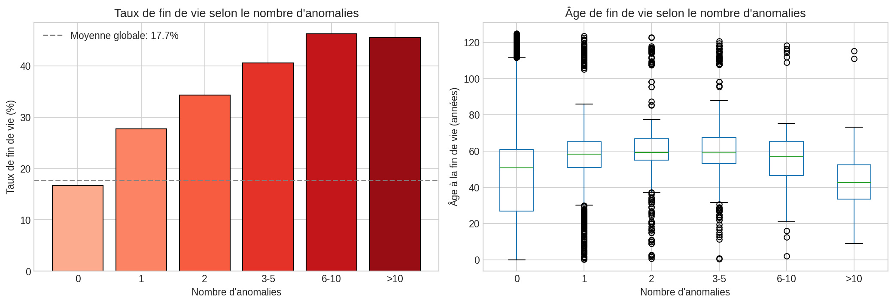
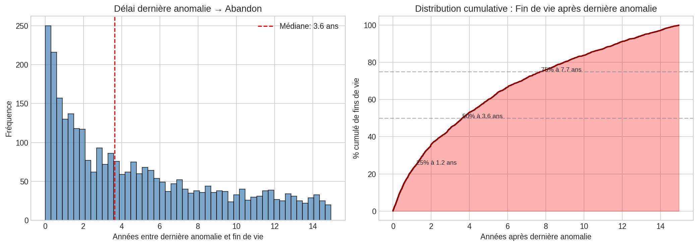
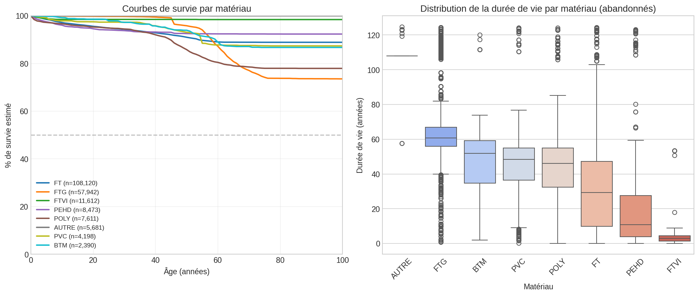
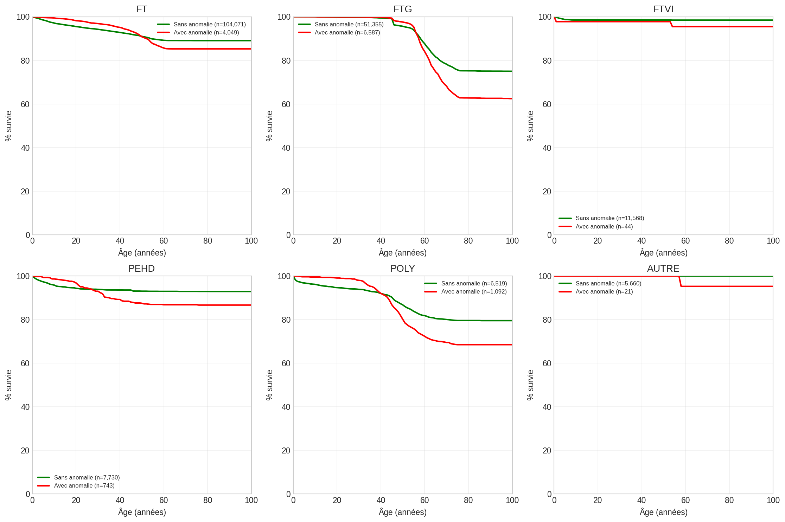
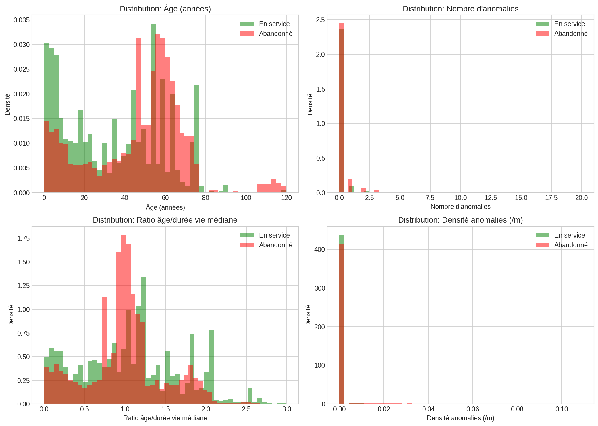

# Analyse Survie : Corrélation Anomalies / Fin de Vie

*Date: 2026-02-03 12:34*

## Objectif

Analyser la relation entre les anomalies et la fin de vie des canalisations 
pour construire un modèle de prédiction de casse alimentant un moteur 
d'optimisation des plans de renouvellement.

## 1. État du parc de canalisations

| Statut | Nombre | % |

|--------|--------|---|

| EN SERVICE | 179,537 | 82.3% |

| ABANDONNÉ (fin de vie) | 38,604 | 17.7% |

| **TOTAL** | 218,141 | 100% |

## 2. Corrélation Anomalies → Fin de vie

### 2.1 Taux de fin de vie selon présence d'anomalie

| Groupe | N tronçons | N abandonnés | Taux fin de vie |

|--------|------------|--------------|------------------|

| Sans anomalie | 204,134 | 34,198 | 16.75% |

| Avec anomalie(s) | 14,007 | 4,406 | 31.46% |

**Risque relatif (RR)** = 1.88

→ Un tronçon avec anomalie a **1.9x plus de risque** d'être abandonné.

**Test Chi²**: χ² = 1,944.5, p-value < 0.001 → Association **hautement significative**

### 2.2 Taux de fin de vie selon le nombre d'anomalies

| Nb anomalies | N tronçons | N abandonnés | Taux fin de vie |

|--------------|------------|--------------|------------------|

| 0 | 204,134 | 34,198 | 16.75% |

| 1 | 9,092 | 2,520 | 27.72% |

| 2 | 2,390 | 821 | 34.35% |

| 3-5 | 1,759 | 713 | 40.53% |

| 6-10 | 487 | 225 | 46.20% |

| >10 | 279 | 127 | 45.52% |

### 2.3 Séquence temporelle : Anomalie → Fin de vie

Parmi les 4,406 tronçons abandonnés avec anomalies:

- Délai médian dernière anomalie → fin de vie: **4.0 ans**

- Délai moyen: 5.8 ans

- 25% des cas: < 1.2 ans

- 75% des cas: < 9.3 ans

⚠️ 105 cas où la dernière anomalie est APRÈS la date d'abandon 
(incohérence données ou anomalie détectée post-abandon)

## 3. Analyse de survie par matériau

### 3.1 Statistiques de survie par matériau

| Matériau | N total | N abandonnés | Taux abandon | Durée médiane | Durée moyenne |

|----------|---------|--------------|--------------|---------------|---------------|

| FT | 108,120 | 12,089 | 11.2% | 26 ans | 29 ans |

| FTG | 57,942 | 16,033 | 27.7% | 64 ans | 70 ans |

| FTVI | 11,612 | 184 | 1.6% | 4 ans | 4 ans |

| PEHD | 8,473 | 686 | 8.1% | 12 ans | 22 ans |

| POLY | 7,611 | 1,742 | 22.9% | 52 ans | 52 ans |

| AUTRE | 5,681 | 41 | 0.7% | 124 ans | 123 ans |

| PVC | 4,198 | 555 | 13.2% | 63 ans | 73 ans |

| BTM | 2,390 | 323 | 13.5% | 53 ans | 51 ans |

| ACIE | 1,752 | 339 | 19.3% | 55 ans | 54 ans |

| A.C | 407 | 87 | 21.4% | 63 ans | 62 ans |

| FTTT | 312 | 8 | 2.6% | 2 ans | 2 ans |

| BIOR | 275 | 22 | 8.0% | 17 ans | 18 ans |

| FTBLU | 180 | 1 | 0.6% | 7 ans | 7 ans |

| FER | 115 | 49 | 42.6% | 55 ans | 57 ans |

| FTTTVI | 92 | 4 | 4.3% | 2 ans | 2 ans |

### 3.2 Impact des anomalies sur la survie par matériau

| Matériau | Avec ano: durée médiane | Sans ano: durée médiane | Différence |

|----------|-------------------------|-------------------------|------------|

| FT | 47 ans | 28 ans | +20 ans |

| FTG | 62 ans | 61 ans | +2 ans |

| FTVI | 27 ans | 3 ans | +24 ans |

| PEHD | 30 ans | 8 ans | +22 ans |

| POLY | 48 ans | 46 ans | +2 ans |

| AUTRE | 58 ans | 108 ans | -50 ans |

## 4. Features prédictives pour le modèle de casse

### 4.1 Pouvoir prédictif des features (corrélation avec fin de vie)

| Feature | Corrélation Pearson | p-value | Odds Ratio (si binaire) |

|---------|---------------------|---------|-------------------------|

| duration_years | 0.046 | 8.88e-97 | - |

| n_anomalies | 0.054 | 7.79e-133 | - |

| n_recent_ano | -0.009 | 9.19e-05 | - |

| ano_density | 0.060 | 3.97e-166 | - |

| age_ratio | -0.048 | 1.38e-108 | - |

| over_median_life | -0.044 | 9.02e-90 | 0.78 |

| DIAMETRE | -0.019 | 1.77e-17 | - |

| LNG | -0.001 | 5.13e-01 | - |

### 4.2 Comparaison des profils : Abandonnés vs En service

| Caractéristique | En service | Abandonnés | Test stat | p-value |

|-----------------|------------|------------|-----------|----------|

| duration_years | 41.0 | 53.0 | 2416278114 | 0.00e+00 |

| n_anomalies | 0.0 | 0.0 | 2668467656 | 0.00e+00 |

| DIAMETRE | 100.0 | 100.0 | 2914151690 | 1.52e-08 |

| LNG | 13.9 | 10.7 | 3063513348 | 9.35e-92 |

## 5. Dataset pour modélisation

### Dataset généré

- **Fichier**: `data/processed/dataset_survival_modeling.csv`

- **Dimensions**: 209,557 lignes × 17 colonnes

- **Tronçons abandonnés**: 32,269 (15.4%)

### Variables disponibles

| Variable | Type | Description | Usage |

|----------|------|-------------|-------|

| GID | ID | Identifiant tronçon | Jointure |

| MAT | Catégoriel | Matériau | Feature |

| DIAMETRE | Numérique | Diamètre (mm) | Feature |

| LNG | Numérique | Longueur (m) | Feature |

| duration_years | Numérique | Âge actuel ou à l'abandon | Feature |

| n_anomalies | Numérique | Nombre total d'anomalies | Feature |

| n_recent_ano | Numérique | Anomalies < 5 ans | Feature |

| age_ratio | Numérique | Âge / durée vie médiane mat. | Feature |

| survival_time | Numérique | Temps de survie observé | Cible survie |

| survival_event | Binaire | 1=abandonné, 0=censuré | Cible survie |

| target_abandoned | Binaire | Tronçon abandonné | Cible classif |

### Utilisation pour l'optimisation

Le modèle de prédiction génère pour chaque tronçon en service:
1. **Probabilité de casse à horizon H** (ex: 1, 3, 5, 10 ans)
2. **Score de risque** (hazard ratio ou probabilité calibrée)

Ces sorties alimentent le **moteur d'optimisation** qui:
- Maximise le nombre de casses évitées sous contrainte budgétaire
- Priorise les renouvellements selon le ratio coût/bénéfice
- Génère des plans pluriannuels optimaux
