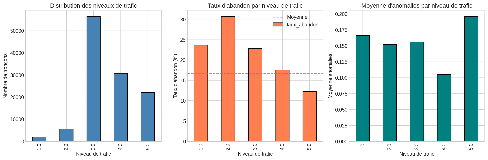
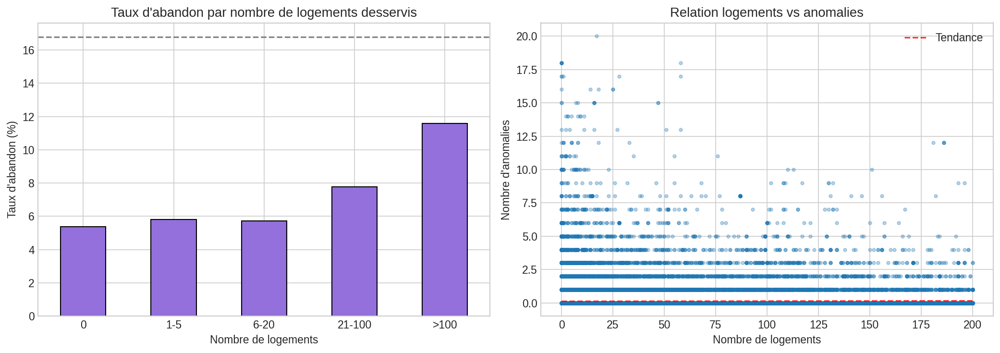
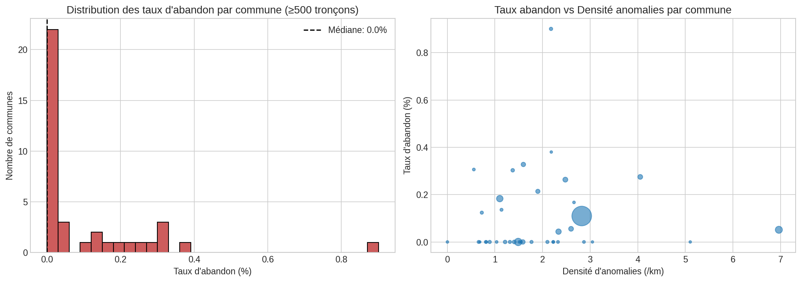
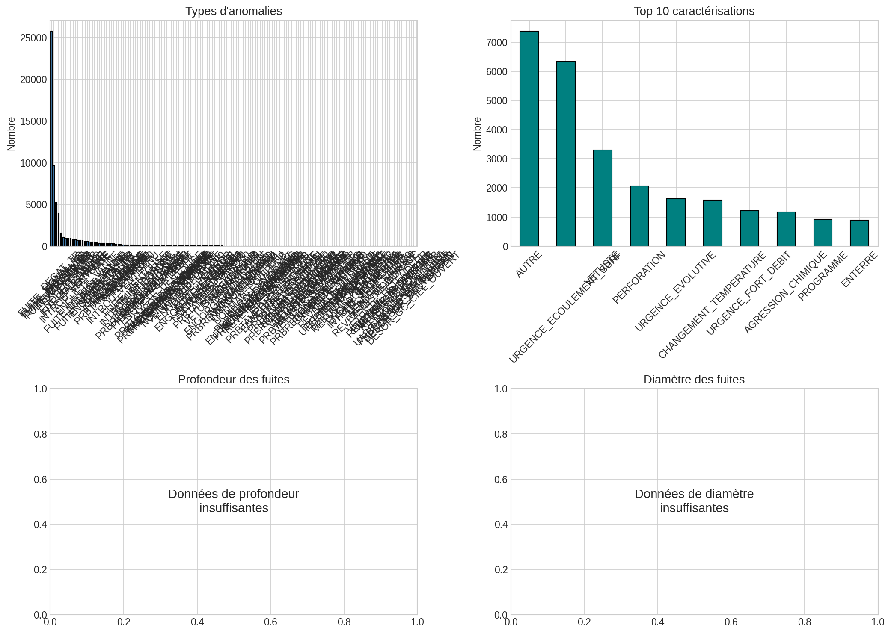
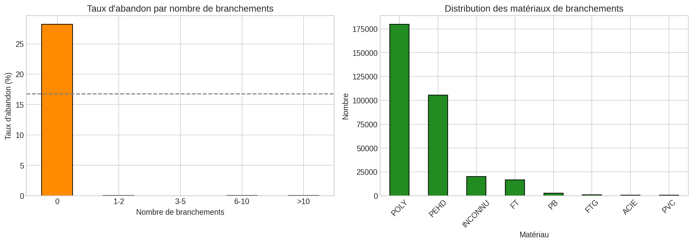

# Analyse des Données Contextuelles

*Date: 2026-02-03 12:43*

## 1. Objectif

Analyser les variables contextuelles disponibles (trafic, logements, communes, 
branchements) et identifier les données manquantes pour améliorer le modèle.

## 2. Impact du trafic routier (DT_FLUX_CIRCULATION)

### 2.1 Distribution des niveaux de trafic

| Niveau trafic | N tronçons | % |

|---------------|------------|---|

| 1.0 | 1,897 | 0.8% |

| 2.0 | 5,539 | 2.4% |

| 3.0 | 56,384 | 24.5% |

| 4.0 | 30,702 | 13.4% |

| 5.0 | 22,025 | 9.6% |

### 2.2 Corrélation trafic → Fin de vie

| Niveau trafic | N tronçons | Taux abandon | Moy. anomalies |

|---------------|------------|--------------|----------------|

| 1.0 | 1,897 | 23.6% | 0.17 |

| 2.0 | 5,539 | 30.7% | 0.15 |

| 3.0 | 56,384 | 22.9% | 0.16 |

| 4.0 | 30,702 | 17.6% | 0.11 |

| 5.0 | 22,025 | 12.3% | 0.20 |

**Corrélation Spearman**: ρ = -0.116, p-value = 0.00e+00

→ Plus le trafic est élevé, moins le risque d'abandon.

## 3. Impact du nombre de logements et abonnés

### 3.1 Statistiques descriptives

| Variable | Min | Médiane | Moyenne | Max | % renseigné |

|----------|-----|---------|---------|-----|-------------|

| Nb logements | 0 | 24 | 96.7 | 10872 | 72.7% |

| Nb abonnés | 0 | 16 | 52.7 | 5298 | 72.7% |

### 3.2 Impact du nombre de logements desservis

| Nb logements | N tronçons | Taux abandon | Moy. anomalies |

|--------------|------------|--------------|----------------|

| 0 | 25,346 | 5.4% | 0.10 |

| 1-5 | 19,343 | 5.8% | 0.15 |

| 6-20 | 32,777 | 5.7% | 0.14 |

| 21-100 | 55,177 | 7.8% | 0.12 |

| >100 | 34,295 | 11.6% | 0.14 |

**Corrélation Spearman (logements vs abandon)**: ρ = 0.081, p = 1.33e-238

**Corrélation Spearman (abonnés vs abandon)**: ρ = 0.057, p = 1.66e-118

## 4. Analyse géographique par commune

### 4.1 Top 20 communes par nombre de tronçons

| GID Commune | N tronçons | Taux abandon | Densité ano (/km) |

|-------------|------------|--------------|-------------------|

| 20000613.0 | 30,094 | 0.1% | 2.82 |

| 20000674.0 | 4,333 | 0.0% | 1.49 |

| 20000693.0 | 3,888 | 0.1% | 6.96 |

| 20000664.0 | 3,275 | 0.2% | 1.10 |

| 20000623.0 | 2,293 | 0.0% | 2.34 |

| 20000627.0 | 1,898 | 0.3% | 2.48 |

| 20000615.0 | 1,818 | 0.3% | 4.05 |

| 20000626.0 | 1,800 | 0.1% | 2.60 |

| 20000614.0 | 1,577 | 0.0% | 1.59 |

| 20000679.0 | 1,526 | 0.3% | 1.60 |

| 20000619.0 | 1,402 | 0.2% | 1.90 |

| 20000673.0 | 1,123 | 0.0% | 1.41 |

| 20000622.0 | 1,007 | 0.0% | 1.21 |

| 20000657.0 | 990 | 0.3% | 1.37 |

| 20000653.0 | 888 | 0.9% | 2.18 |

| 20000624.0 | 862 | 0.0% | 0.89 |

| 20000661.0 | 823 | 0.0% | 1.31 |

| 20800005.0 | 820 | 0.0% | 2.10 |

| 20000616.0 | 807 | 0.1% | 0.72 |

| 20000645.0 | 800 | 0.0% | 1.77 |

### 4.2 Communes à risque (≥500 tronçons, taux abandon élevé)

| GID Commune | N tronçons | Taux abandon | Densité ano (/km) |

|-------------|------------|--------------|-------------------|

| 20000653.0 | 888 | 0.9% | 2.18 |

| 20000671.0 | 526 | 0.4% | 2.18 |

| 20000679.0 | 1,526 | 0.3% | 1.60 |

| 20000670.0 | 653 | 0.3% | 0.56 |

| 20000657.0 | 990 | 0.3% | 1.37 |

| 20000615.0 | 1,818 | 0.3% | 4.05 |

| 20000627.0 | 1,898 | 0.3% | 2.48 |

| 20000619.0 | 1,402 | 0.2% | 1.90 |

| 20000664.0 | 3,275 | 0.2% | 1.10 |

| 20000646.0 | 598 | 0.2% | 2.66 |

### 4.3 Variabilité inter-communes

- Nombre de communes: 97

- Taux abandon min: 0.0%

- Taux abandon max: 0.9%

- Taux abandon médian: 0.0%

- Écart-type: 0.2%

## 5. Caractéristiques détaillées des anomalies

### 5.1 Profondeur des fuites

- Données disponibles: 0 (0.0%)

### 5.2 Causes des fuites

- Données disponibles: 0 (0.0%)

### 5.3 Diamètre des fuites

- Données disponibles: 0 (0.0%)

### 5.4 Types d'anomalies

| Type | Nombre | % |

|------|--------|---|

| FUITE_SIGNAL_TR | 25,768 | 41.8% |

| FUITE_SIGNAL_BR | 9,598 | 15.6% |

| FUITE_DETECT_BR | 5,211 | 8.5% |

| FUITE_DETECT_TR | 3,951 | 6.4% |

| DEGAT_TR | 1,594 | 2.6% |

| INTROU_VANNE | 1,084 | 1.8% |

| INA_VANNE | 931 | 1.5% |

| VETUSTE_BR | 906 | 1.5% |

| ENQUETE_EQUIP | 896 | 1.5% |

| INTROU_VIDANGE | 756 | 1.2% |

| INTROU_VENTOUSE | 740 | 1.2% |

| DEGAT_BR | 719 | 1.2% |

| INA_BR | 701 | 1.1% |

| EAU_ROUGE | 637 | 1.0% |

| FUITE_DETECT_VANNE | 544 | 0.9% |

| ENQUETE_VANNE | 535 | 0.9% |

| HS_VANNE | 516 | 0.8% |

| HS_BR | 509 | 0.8% |

| FUITE_SIGNAL_VANNE | 418 | 0.7% |

| NONMAN_VANNE | 377 | 0.6% |

| FUITE | 364 | 0.6% |

| ENGORGE_VANNE | 358 | 0.6% |

| NONMAN_BR | 338 | 0.5% |

| REVETSOL_BR | 313 | 0.5% |

| ENGORGE_BR | 299 | 0.5% |

| PRBTAMPON_VANNE | 271 | 0.4% |

| INTROU_VAIR200 | 270 | 0.4% |

| INA_VENTOUSE | 240 | 0.4% |

| HS_VENTOUSE | 215 | 0.3% |

| HS_HYDRANT | 186 | 0.3% |

| INTROU_VENTMANU | 159 | 0.3% |

| INA_VIDANGE | 150 | 0.2% |

| INA_VAIR200 | 147 | 0.2% |

| INTROU_BR | 122 | 0.2% |

| HS_VAIR200 | 116 | 0.2% |

| FUITE_VENTOUSE | 101 | 0.2% |

| INTROU_VIDBORGNE | 76 | 0.1% |

| PRBREGARD_VENTOUSE | 68 | 0.1% |

| VETUSTE_VANNE | 66 | 0.1% |

| FUITE_VAIR200 | 61 | 0.1% |

| DEFAUT_PRESSION | 61 | 0.1% |

| PRBREGARD_VAIR200 | 59 | 0.1% |

| INTROU_VIDRACC | 47 | 0.1% |

| REVETSOL_VANNE | 47 | 0.1% |

| ENQUETE_HYDRANT | 45 | 0.1% |

| PRBTAMPON_VENTOUSE | 43 | 0.1% |

| INA_VENTMANU | 43 | 0.1% |

| PRBREGARD_VIDBORGNE | 39 | 0.1% |

| PRBREGARD_VIDANGE | 38 | 0.1% |

| PRBTAMPON_VIDANGE | 38 | 0.1% |

| VETUSTE_VENTOUSE | 36 | 0.1% |

| ENGORGE_VIDANGE | 36 | 0.1% |

| NONMAN_VIDANGE | 35 | 0.1% |

| NONMAN_VENTOUSE | 35 | 0.1% |

| SABLE | 34 | 0.1% |

| VETUSTE_HYDRANT | 33 | 0.1% |

| HS_EQUIPPUB | 29 | 0.0% |

| HS_VIDANGE | 25 | 0.0% |

| ENGORGE_VAIR200 | 23 | 0.0% |

| INA_VIDBORGNE | 22 | 0.0% |

| ENGORGE_VENTOUSE | 22 | 0.0% |

| TARTRE | 21 | 0.0% |

| ODEUR | 21 | 0.0% |

| FUITE_VIDANGE | 21 | 0.0% |

| INTROU_VAIR500 | 20 | 0.0% |

| NONMAN_HYDRANT | 20 | 0.0% |

| VETUSTE_VAIR200 | 18 | 0.0% |

| PRBTAMPON_VAIR200 | 17 | 0.0% |

| HS_VENTMANU | 15 | 0.0% |

| SAVEUR | 14 | 0.0% |

| INA_VAIR1000 | 13 | 0.0% |

| VETUSTE_EQUIPPUB | 13 | 0.0% |

| HS_VAIR500 | 12 | 0.0% |

| ENGORGE_VIDBORGNE | 12 | 0.0% |

| PRESENCE_AIR | 12 | 0.0% |

| PRBREGARD_VENTMANU | 11 | 0.0% |

| INA_HYDRANT | 11 | 0.0% |

| HS_VAIR1000 | 11 | 0.0% |

| OBSTRUCTION | 11 | 0.0% |

| NONMAN_VAIR200 | 10 | 0.0% |

| INTROU_EQUIPPUB | 10 | 0.0% |

| INTROU_VAIR1000 | 10 | 0.0% |

| INA_VIDRACC | 8 | 0.0% |

| NONMAN_EQUIPPUB | 8 | 0.0% |

| ENTRETIEN_CRT_REGARD | 8 | 0.0% |

| PRBREGARD_VIDRACC | 7 | 0.0% |

| PRBTAMPON_VENTMANU | 7 | 0.0% |

| INTROU_HYDRANT | 7 | 0.0% |

| NONMAN_VIDBORGNE | 7 | 0.0% |

| REVETSOL_VENTOUSE | 7 | 0.0% |

| VOL_EAU | 7 | 0.0% |

| INA_HYDROSTAB | 6 | 0.0% |

| PRBTAMPON_VIDBORGNE | 6 | 0.0% |

| FUITE_MONOVAR | 6 | 0.0% |

| FUITE_VAIR500 | 6 | 0.0% |

| INA_SECMESDEB | 5 | 0.0% |

| ENGORGE_VENTMANU | 5 | 0.0% |

| VETUSTE_VIDANGE | 5 | 0.0% |

| INA_VAIR500 | 5 | 0.0% |

| PRBREGARD_VAIR1000 | 5 | 0.0% |

| PRBREGARD_HYDROSTAB | 5 | 0.0% |

| FUITE_VIDBORGNE | 5 | 0.0% |

| INA_EQUIPPUB | 5 | 0.0% |

| NONMAN_VENTMANU | 4 | 0.0% |

| FUITE_SECMESDEB | 4 | 0.0% |

| FUITE_DETENDEUR | 4 | 0.0% |

| PRBTAMPON_HYDROSTAB | 4 | 0.0% |

| VETUSTE_VENTMANU | 4 | 0.0% |

| VETUSTE_MONOVAR | 4 | 0.0% |

| REVETSOL_VIDANGE | 4 | 0.0% |

| VETUSTE_SECMESDEB | 4 | 0.0% |

| PRBREGARD_SECMESDEB | 3 | 0.0% |

| INTROU_PURGE | 3 | 0.0% |

| HS_VIDRACC | 3 | 0.0% |

| HS_PURGE | 3 | 0.0% |

| NONMAN_VIDRACC | 3 | 0.0% |

| ENGORGE_VIDRACC | 3 | 0.0% |

| FUITE_VENTMANU | 3 | 0.0% |

| HS_VIDBORGNE | 3 | 0.0% |

| REVETSOL_HYDRANT | 3 | 0.0% |

| FUITE_VAIR1000 | 3 | 0.0% |

| UFERMETURE_REGARD | 3 | 0.0% |

| PRBREGARD_VAIR500 | 2 | 0.0% |

| INA_DETENDEUR | 2 | 0.0% |

| NONMAN_MVENT | 2 | 0.0% |

| PRBTAMPON_VIDRACC | 2 | 0.0% |

| VETUSTE_HYDROSTAB | 2 | 0.0% |

| FUITE_VIDRACC | 2 | 0.0% |

| INTROU_MVENT | 2 | 0.0% |

| FUITE_MVENT | 1 | 0.0% |

| ENGORGE_VAIR1000 | 1 | 0.0% |

| INTROU_SECMESDEB | 1 | 0.0% |

| INA_PURGE | 1 | 0.0% |

| FUITE_HYDROSTAB | 1 | 0.0% |

| HS_SECMESDEB | 1 | 0.0% |

| REVETSOL_VIDBORGNE | 1 | 0.0% |

| INA_MVENT | 1 | 0.0% |

| NONMAN_VAIR500 | 1 | 0.0% |

| VETUSTE_VAIR500 | 1 | 0.0% |

| VETUSTE_VIDRACC | 1 | 0.0% |

| VETUSTE_DETENDEUR | 1 | 0.0% |

| REVETSOL_HYDROSTAB | 1 | 0.0% |

| PRBTAMPON_VAIR1000 | 1 | 0.0% |

| VETUSTE_VIDBORGNE | 1 | 0.0% |

| PRBREGARD_PURGE | 1 | 0.0% |

| REVETSOL_EQUIPPUB | 1 | 0.0% |

| UARB_MEN_ESPACE_VERT | 1 | 0.0% |

| PRBREGARD_DETENDEUR | 1 | 0.0% |

| ENTC_ESPACE_VERT | 1 | 0.0% |

| DESOR_GC_SOUTERRAIN | 1 | 0.0% |

| NONMAN_VAIR1000 | 1 | 0.0% |

| DESOR_GC_CIEL_OUVERT | 1 | 0.0% |

| DESOR_GC_REGARD | 1 | 0.0% |

### 5.5 Caractérisation des anomalies

| Caractérisation | Nombre | % |

|-----------------|--------|---|

| AUTRE | 7,381 | 12.0% |

| URGENCE_ECOULEMENT_SURF | 6,336 | 10.3% |

| VETUSTE | 3,303 | 5.4% |

| PERFORATION | 2,072 | 3.4% |

| URGENCE_EVOLUTIVE | 1,627 | 2.6% |

| CHANGEMENT_TEMPERATURE | 1,580 | 2.6% |

| URGENCE_FORT_DEBIT | 1,212 | 2.0% |

| AGRESSION_CHIMIQUE | 1,168 | 1.9% |

| PROGRAMME | 922 | 1.5% |

| ENTERRE | 896 | 1.5% |

| URGENCE_INFILTRATION | 885 | 1.4% |

| FORTE_CORROSION | 550 | 0.9% |

| MAUVAIS_ETAT | 386 | 0.6% |

| TERRE | 370 | 0.6% |

| MOUVEMENT_SOL | 324 | 0.5% |

## 6. Impact des branchements

### 6.1 Statistiques des branchements

- Nombre total de branchements: 381,449

- Tronçons avec branchements: 93,123

- Moyenne branchements/tronçon: 1.8

- Médiane: 0

- Max: 97

### 6.2 Impact du nombre de branchements

| Nb branchements | N tronçons | Taux abandon | Moy. anomalies |

|-----------------|------------|--------------|----------------|

| 0 | 136,782 | 28.2% | 0.12 |

| 1-2 | 48,693 | 0.0% | 0.12 |

| 3-5 | 20,795 | 0.0% | 0.23 |

| 6-10 | 13,682 | 0.0% | 0.31 |

| >10 | 9,953 | 0.0% | 0.38 |

**Corrélation Spearman (branchements vs anomalies)**: ρ = 0.109, p = 0.00e+00

### 6.3 Matériaux des branchements

| Matériau | Nombre | % |

|----------|--------|---|

| POLY | 179,792 | 47.1% |

| PEHD | 105,624 | 27.7% |

| INCONNU | 20,078 | 5.3% |

| FT | 16,717 | 4.4% |

| PB | 2,648 | 0.7% |

| FTG | 814 | 0.2% |

| ACIE | 676 | 0.2% |

| PVC | 598 | 0.2% |

| FTVI | 306 | 0.1% |

| CUIVRE | 113 | 0.0% |

## 7. Synthèse : Données disponibles vs manquantes

### 7.1 Variables contextuelles disponibles

| Variable | Source | % renseigné | Impact observé |

|----------|--------|-------------|----------------|

| DT_FLUX_CIRCULATION | TronconDT | 50.7% | Modéré |

| DT_NB_LOGEMENT | TronconDT | 72.7% | Faible |

| DT_NB_ABONNE | TronconDT | 72.7% | Faible |

| GID_COMMUNE | commune | 36.3% | Élevé (effet zone) |

| n_branchements | branchement | 40.5% | Modéré |

### 7.2 Variables manquantes (non disponibles dans les données)

| Variable | Importance pour prédiction | Source typique |

|----------|---------------------------|----------------|

| Pression réseau | Élevée | Capteurs de pression |

| Vitesse d'écoulement | Élevée | Modèle hydraulique |

| Type de sol/terrain | Élevée | SIG géologique |

| Profondeur enfouissement | Modérée | Relevé terrain |

| Corrosivité du sol | Élevée | Analyse géotechnique |

| Température sol | Modérée | Capteurs/modèle |

| Mouvements de terrain | Élevée | SIG risques naturels |

### 7.3 Recommandations pour enrichir les données

1. **Pression et vitesse** : Intégrer les données du modèle hydraulique (EPANET ou similaire)
2. **Sol et terrain** : Croiser avec les données géologiques du BRGM
3. **Risques naturels** : Ajouter les zones de retrait-gonflement des argiles
4. **Historique interventions** : Ajouter les données de maintenance préventive
5. **Qualité de l'eau** : Corrosivité, pH, chlorures peuvent impacter les matériaux
